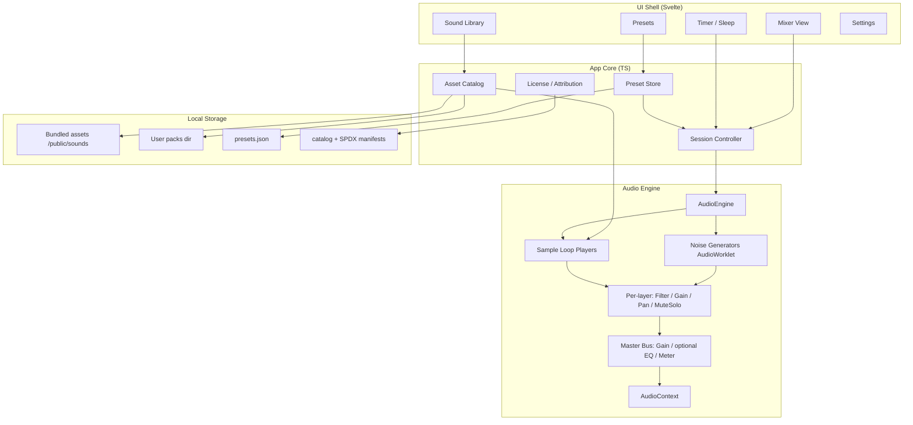
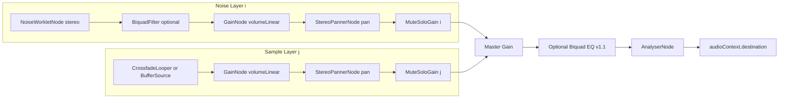
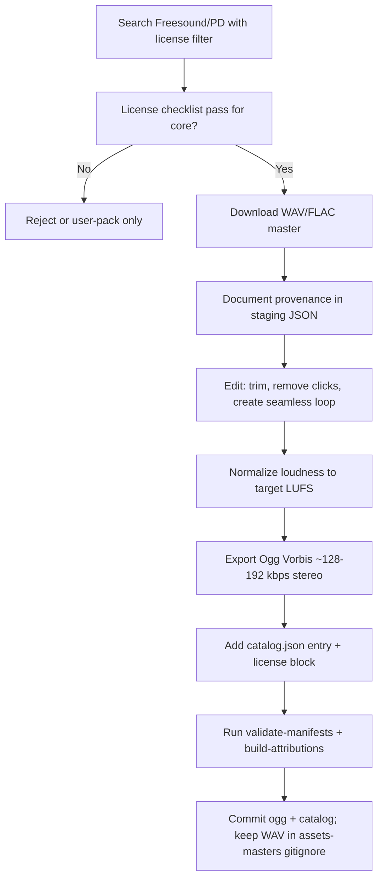
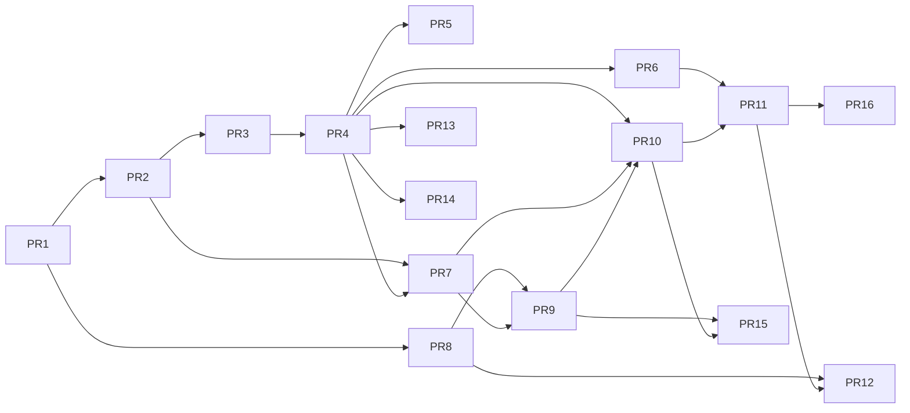

# Ambient Sound & Noise Player — Design Document

| Field | Value |
|-------|--------|
| **Title** | Ambient Sound & Noise Player |
| **Author** | TBD |
| **Date** | 2026-07-31 |
| **Status** | Draft (revised after design review) |
| **Workspace** | `C:\Users\marti\Projects\tools\ambient-sound` |
| **Document type** | Architecture & implementation design (greenfield) |
| **App source license** | **MIT** (resolved 2026-07-31) |

---

## Overview

This document specifies a desktop-first ambient sound and noise player for focus, sleep, relaxation, and sound masking. The app combines two sound families: **procedural noise** (white, pink, brown, blue, violet, and filtered variants) generated in real time with no sample files, and **ambient natural layers** (rain, ocean, forest, fire, etc.) sourced from free, legally redistributable recordings with explicit licensing and attribution.

The recommended stack is **TypeScript + Vite + Svelte 5 + Web Audio API / AudioWorklet**, packaged as a **Tauri 2** desktop app (primary target: Windows) with a same-codebase **PWA** path for browsers. The audio engine is a graph of gain/filter/pan nodes with a master bus, sleep timer with fade-out, multi-layer mixer (volume / mute / solo / pan), and local preset persistence. Assets ship as a small bundled “core pack” (CC0 / CC-BY from Freesound and verified PD only by default) plus optional user-importable packs; licensing is tracked via SPDX-style metadata and an auto-generated `ATTRIBUTIONS.md`.

### Definition of Done — v0.1.0

A release may be tagged `v0.1.0` when all of the following are true:

| Criterion | Bar |
|-----------|-----|
| Desktop install | Windows Tauri build installs and launches on Win10/11 WebView2 |
| Noise types | White, pink, brown, blue, violet + rain/fan/static modes play without clicks |
| Ambient samples | ≥3 categories in core pack, each CC0 or CC-BY with complete manifest |
| Mixer | Multi-layer volume, mute, solo, pan; noise stereo width; master volume |
| Timer | Sleep timer with wall-clock scheduling and cancelable master fade-out |
| Presets | Save/load/export/import; restore last session on launch |
| Compliance | `validate-manifests` in CI; in-app Attributions page; root `ATTRIBUTIONS.md` |
| Tests | DSP unit tests + preset round-trip + solo/mute matrix tests green in CI |
| Manual QA | `docs/qa-checklist.md` signed off in the release PR description |

Out of v0.1.0 (explicitly later): master 3-band EQ, system tray / global hotkeys, output device picker, PWA (optional nice-to-have if already done).

---

## Background & Motivation

### Problem

People use noise generators and nature soundscapes for concentration, sleep, and sound masking. Existing options are often:

- SaaS web players with ads, accounts, or subscriptions
- Mobile apps with limited desktop UX and offline reliability
- Single-purpose white-noise tools without layered ambient scenes
- Sample-only apps that cannot generate colored noise without large files

There is no first-class, offline-first personal tool in this workspace that unifies **real-time noise synthesis** with **layered ambient samples**, presets, and a sleep timer under clear free-license asset policy.

### Current state

The repository is empty (greenfield). No prior audio engine, UI, or asset pipeline exists.

### Pain points to avoid from day one

| Pain | Mitigation in this design |
|------|---------------------------|
| License ambiguity on ambient clips | Documented acquisition pipeline + SPDX metadata + `ATTRIBUTIONS.md`; core pack = CC0/CC-BY only |
| CPU spikes from many layers | AudioWorklet noise, shared master bus, layer caps, metering |
| Loop clicks / seams | Crossfade loop editing guidance + runtime crossfade looper algorithm |
| Desktop bloat (Electron-class) | Tauri 2 thin shell around web UI |
| Hard-to-test audio | Deterministic DSP unit tests + interface mocks + manual listen checklist |

---

## Goals & Non-Goals

### Goals (v1 / v0.1.0)

1. **Real-time colored noise synthesis** without sample files (white, pink, brown/red, blue, violet, plus rain/fan/static filtered modes).
2. **Multi-layer mixing**: concurrent noise + ambient sample layers with independent **volume, mute, solo, and pan**; noise layers also expose **stereo width**.
3. **Ambient sample playback** with seamless/gapless looping (native or crossfade modes).
4. **Sleep / session timer** with cancelable master fade-out (wall-clock based).
5. **Presets**: save/load named layer combinations; **restore last session on launch**.
6. **Offline-first** on desktop: full core experience without network after install.
7. **Licensing compliance** for all redistributed audio: source, license ID, attribution text, URL.
8. **Windows-primary** personal tool with a path to macOS/Linux and browser PWA.
9. **Documented sound acquisition plan** so contributors can add free ambient assets safely.
10. **Basic keyboard UX**: Space = play/pause (global within app window); optional number keys 1–9 load favorite presets when focused.

### Non-Goals (v1)

- Streaming from remote live radio or paid content APIs
- User accounts, cloud sync, or multi-device collaboration
- Generative AI music or text-to-sound models
- DAW-grade editing, recording, or export of long mixes (optional later: short offline bounce)
- Spatial 3D / HRTF binaural beyond simple stereo pan and width
- Mobile native apps (iOS/Android) as a first-class v1 target
- Monetization, ads, or telemetry that phones home by default
- **Master parametric / 3-band EQ** (deferred to **v1.1**, feature-flagged)
- **System tray / run minimized / global hotkeys while unfocused** (deferred to **v1.1**; sleep remains supported via in-window timer + optional “keep window open” guidance)
- **Output device selection** (`setSinkId` / exclusive WASAPI) — deferred until WebView2 support is verified
- **Tone.js / Howler.js** as the audio core (see Alternatives)

---

## Key Decisions

| # | Decision | Choice | Rationale |
|---|----------|--------|-----------|
| KD-1 | **Primary runtime** | Tauri 2 desktop app wrapping a web UI | Native window + FS access + small binary vs Electron; reuses Web Audio; fits personal tools on Windows with future macOS/Linux. See **Windows UX constraints** below. |
| KD-2 | **UI framework** | **Svelte 5 + TypeScript + Vite** (locked for v1; no React alternative) | Confirmed 2026-07-31. Low boilerplate, excellent reactivity for mixer sliders, small bundle; fine for a focused tool UI. |
| KD-3 | **Audio pipeline** | Web Audio API + AudioWorklet for noise | Standard, low-latency enough for ambient use, same code in Tauri WebView and PWA; Worklet keeps noise DSP off main thread. |
| KD-4 | **Noise vs samples** | Synthesize all colored noises; samples only for nature/ambience | No files for noise family; smaller install; continuous infinite playback; samples where synthesis is implausible. |
| KD-5 | **Asset strategy** | Small bundled core pack + user-imported packs (local) | Offline core UX; no mandatory CDN; users can add packs without bloating git. |
| KD-6 | **Sample format** | Ogg Vorbis (or Opus in WebM) for ship; WAV masters out-of-repo | Good compression for loops; wide WebView support; masters kept outside git or in LFS if needed. |
| KD-7 | **Preset storage** | Local JSON via Tauri FS (desktop) / IndexedDB (PWA) | Offline-first, no backend; simple schema versioning. |
| KD-8 | **Licensing process** | SPDX-style `manifest.json` + generated `ATTRIBUTIONS.md` | Auditability; fails CI if redistributed asset lacks license fields. |
| KD-9 | **Layer model** | Unified `Layer` abstraction (noise \| sample) into a master bus | One mixer UI and preset format for both source types. |
| KD-10 | **v1 platform priority** | Windows desktop first; PWA second; store packaging later | Matches developer machine and “local tools” use case; web remains portable core. |
| KD-11 | **Pan / width / EQ scope** | **v1:** per-layer pan + noise stereo width. **v1.1:** optional master 3-band EQ (feature-flagged). | Pan/width are product-essential and cheap; full master EQ can wait without blocking a useful mixer. |
| KD-12 | **Testing philosophy** | Unit-test DSP math offline; mock node graph for wiring; no golden-audio byte compare | Audio is continuous/random; test algorithms, solo/mute matrix, and preset I/O deterministically. |
| KD-13 | **Volume units** | **Store and automate linear gain `0..1`** (`volumeLinear`). UI faders are **dB −60…0** with mute = linear 0. | Single source of truth in `curves.ts`; presets/engine never mix units; fades automate linear (or equal-power on linear gains). |
| KD-14 | **Core-pack sources** | **Default: Freesound CC0/CC-BY + verified public domain only.** Pixabay/Mixkit/ZapSplat/BBC → personal or user-pack only unless terms re-verified and explicitly approved. | Avoids “stock library redistribution” ambiguity for non-CC stock licenses. |
| KD-15 | **Package manager** | **pnpm** (pin via `packageManager` in `package.json`) | Consistent Windows installs; scripts documented as `pnpm run …`. |
| KD-16 | **Solo/mute ownership** | `SessionController` owns solo/mute sets; pushes **effective linear gain** into each layer’s `MuteSoloGain` node. Layer params store UI intent (`muted`, `solo`) only. | Avoids dual sources of truth and shared-gate bugs. |
| KD-17 | **App source license** | **MIT** | Resolved 2026-07-31. Permissive app code; core audio remains CC0/CC-BY (SA disallowed in core). Root `LICENSE` is MIT. |
| KD-18 | **System tray / global hotkeys** | **v1.1 only** — not in v0.1.0 DoD | Resolved 2026-07-31. Sleep use relies on in-window timer + wall-clock scheduling; tray/global hotkeys deferred. |

### Windows UX constraints (accepted product constraints)

Tauri 2 on Windows uses **WebView2**. Implementers and users should expect:

| Constraint | Implication |
|------------|-------------|
| **Volume mixer label** | Windows may show the app as “Microsoft Edge WebView2” or similar rather than the product name. Acceptable for v1 personal use; investigate `app.windows` / WebView host options later if branding matters. |
| **Background / sleep audio** | Minimized window generally continues audio while the process runs; **OS sleep / Modern Standby** can suspend the process. Timer uses **wall clock** and re-syncs on `visibilitychange` / focus (see Timer section). System tray + “run in background” is **v1.1**. |
| **Output device selection** | `HTMLMediaElement.setSinkId` / AudioContext sink support varies in WebView2. Deferred (Open Questions). |
| **Autoplay** | `AudioContext` stays suspended until an explicit user gesture (Start / Space). |

---

## Proposed Design

### High-level architecture



### Module responsibilities

| Module | Path (proposed) | Responsibility |
|--------|-----------------|---------------|
| `AudioEngine` | `src/audio/engine.ts` | Owns `AudioContext`, resume-on-gesture, master bus, layer lifecycle |
| `NoiseWorklet` | `src/audio/worklets/noise-processor.ts` | Real-time white→colored noise DSP |
| `NoiseLayer` | `src/audio/layers/noise-layer.ts` | Parameters (type, volume, filter, width, pan) + node wiring |
| `SampleLayer` | `src/audio/layers/sample-layer.ts` | Decode, loop (native/crossfade), gain/pan |
| `MasterBus` | `src/audio/master-bus.ts` | Master gain, optional EQ (v1.1), AnalyserNode metering |
| `SessionController` | `src/app/session.ts` | Play state, timer, fade-out, **solo/mute ownership**, last-session restore |
| `PresetStore` | `src/app/presets.ts` | Load/save/version presets |
| `AssetCatalog` | `src/assets/catalog.ts` | Discover bundled + user packs, resolve playable URLs |
| `LicenseIndex` | `src/assets/licenses.ts` | Validate manifests, build attributions |
| UI routes/views | `src/ui/*` | Mixer, library, timer, presets, settings |

### Audio graph (runtime)

Each layer has its **own** mute/solo gain stage. There is **no** shared SoloMute node.



**Solo/mute ownership and effective gain**

- **UI intent** lives on each layer as `muted: boolean` and `solo: boolean` (also stored in presets).
- **`SessionController`** is the single owner that computes the active set and pushes to the engine:

```ts
// Effective linear multiplier applied on MuteSoloGain (not the user volume fader)
// userVolumeLinear remains on GainNode so unmuting restores the fader level.
function effectiveMuteSolo(muted: boolean, solo: boolean, anySolo: boolean): number {
  if (muted) return 0;
  if (anySolo && !solo) return 0;
  return 1;
}
// GainNode.gain = volumeLinear   (0..1, from dB fader via curves.ts)
// MuteSoloGain.gain = effectiveMuteSolo(...)
```

- **Mute**: `MuteSoloGain → 0`; preserve `volumeLinear` and fader position.
- **Solo**: if any layer has `solo === true`, non-soloed layers get `MuteSoloGain → 0`.
- **Master**: always multiplies after per-layer processing.
- Engine API uses `applyMuteSolo(layerId → 0|1)` or recomputes from a snapshot pushed by Session; do **not** keep a parallel `Set` that can drift from layer params—derive `anySolo` from the current layer list each update.

### Noise synthesis (DSP notes)

All noise types run in an **AudioWorklet** at the context sample rate (typically 48 kHz). Prefer **Gaussian white** as the base (Box–Muller or sum-of-uniforms approximation) for more natural “analog” character; **uniform white** is used for the **static** mode.

**Spectral targets are approximate over the audible band.** Unit tests must check **relative band energy** (e.g. low vs mid vs high octave RMS ratios), not a perfect theoretical PSD.

| Type | Spectral shape | Implementable algorithm (v1) |
|------|----------------|------------------------------|
| **White** | Flat PSD | Gaussian i.i.d. samples (static mode: uniform) |
| **Pink** | −3 dB/oct | **Paul Kellet economy filter** (primary): cheap IIR on white; continuous, no table. Refined Kellet optional if economy is too rough—pick economy for v1, document coefficients in `colored-noise.ts`. |
| **Brown / red** | −6 dB/oct | Leaky integrator on white: `y[n] = clamp(leak * y[n-1] + c * w[n], -1, 1)` with **`leak ≈ 0.996…0.999`** (sample-rate dependent; tune so DC does not dominate) and **`c ≈ 0.02…0.05`** starting point; **normalize output RMS** (see below). |
| **Blue** | +3 dB/oct | **Differentiate pink** (first difference of pink samples), **or** run white through a filter bank approximating +3 dB/oct. Do **not** differentiate white (that is violet). Inverting Kellet-style pink emphasis is acceptable if gain is carefully normalized. |
| **Violet** | +6 dB/oct | First difference of white: **`y[n] = w[n] - w[n-1]`**, then normalize RMS. (Not “differentiate twice,” which would be ~+12 dB/oct.) |
| **Rain-like** | Mid emphasis + slow AM | Pink or brown → bandpass (~1–4 kHz) + slow noise-modulated gain |
| **Fan-like** | Low rumble + optional tonal hint | Brown + gentle lowpass; optional very low-level sine “motor” behind a UI toggle (default off) |
| **Static** | Harsh white | Uniform white + optional light sample-hold / bitcrush |

**Loudness matching across colors**

- After coloring, scale each type so long-window RMS ≈ **−20 dBFS** (linear RMS ≈ 0.1) at `volumeLinear = 1` before the user fader.
- Store per-type calibration gains as constants in `colored-noise.ts`; unit-test RMS within ±2 dB of target over ≥1 s of synthetic buffer.

**Paul Kellet economy pink (reference for implementers)**

Document the exact coefficient set used in code comments (classic economy filter: multi-pole running sum on white). Interface for pure functions under test:

```ts
// src/audio/dsp/colored-noise.ts — pure, no AudioContext
export interface NoiseState { /* type-specific memory */ }
export function createNoiseState(type: NoiseType): NoiseState;
export function processBlock(
  type: NoiseType,
  state: NoiseState,
  outL: Float32Array,
  outR: Float32Array,
  width: number, // 0 mono .. 1 full decorrelated
): void;
```

**Stereo width and pan (signal order)**

1. Generate **independent** L/R noise streams inside the worklet (or mono + decorrelated copy).
2. **Width mix**: `L' = lerp(M, L, width)`, `R' = lerp(M, R, width)` where `M = 0.5*(L+R)`.
3. Output stereo from the worklet → optional biquad (linked channels or mono-then-split) → **GainNode** (`volumeLinear`) → **StereoPannerNode** (`pan` −1…1).

Do not pan first then widen (width would be collapsed). Sample layers skip width (natural stereo already in the file) unless a future “mono-ize” control is added.

**Parameters exposed per noise layer**

```ts
type NoiseType = 'white' | 'pink' | 'brown' | 'blue' | 'violet' | 'rain' | 'fan' | 'static';

interface NoiseLayerParams {
  type: NoiseType;
  /** Linear amplitude 0..1 after curves.dbToLinear. Never store dB here. */
  volumeLinear: number;
  muted: boolean;
  solo: boolean;
  filterType: BiquadFilterType | 'off';
  filterCutoffHz: number;
  filterQ: number;
  stereoWidth: number;  // 0 = mono, 1 = full decorrelated L/R
  pan: number;          // -1..1
}
```

**AudioWorklet load strategy (Vite)**

```ts
// PR 2 — do not use npm imports inside the worklet module for v1
import workletUrl from './worklets/noise-processor.ts?url';
await audioContext.audioWorklet.addModule(workletUrl);
```

- Bundle the worklet as a separate URL asset (`?url`).
- Keep worklet code self-contained (no shared npm package imports inside the processor file) to avoid Vite/worker bundling footguns.
- Register once per `AudioContext`; fail clearly if `addModule` rejects.

**Performance targets (not hard SLAs)**

Measured on a modern Windows laptop, **dev tools closed**, after layers are warm:

| Load | Target | How to measure |
|------|--------|----------------|
| 4 noise + up to 4 **decoded** sample layers | Roughly low single-digit–low teens % of one core; “UI remains responsive” | Windows Task Manager / Performance; optional Chrome `performance` traces; Worklet message with process time every N quanta |
| Audio callback | No main-thread DSP | Code review + profile main thread |
| Startup to audible | < 300 ms after user gesture | `performance.now()` around resume + first layer start |
| Sample decode | Lazy on first enable | Log decode duration |

**Memory**

- Formula (float32 decode): `bytes ≈ channels * sampleRate * durationSec * 4`.
- Example: stereo 48 kHz × 180 s ≈ **69 MB per buffer**. Eight such buffers ≈ **550 MB** if all held decoded — too high for a casual tool.
- **Policy**: decode **at most 4 sample layers** concurrently by default (setting); additional sample layers stay compressed on disk until activated; unloading a layer drops its `AudioBuffer` when not referenced by another layer.
- Core pack loop duration: **30 s–3 min** per file; prefer ≤ **120 s** where possible.
- Soft cap active layers **8–12** (noise + sample combined) with UI warning.

### Ambient sample playback

**Loop strategies**

1. **Native loop** (`AudioBufferSourceNode.loop = true`, full buffer or `loopStart`/`loopEnd` in seconds): use when the file is edited to be sample-accurate seamless. Catalog `loop.mode === 'native'`.
2. **Crossfade looper** (preferred default for nature): dual scheduled sources with equal-power overlap (algorithm below).
3. **One-shots**: thunder and similar — schedule occasional one-shots; not continuous loop layers (product decision for thunder pack).

```ts
interface SampleLayerParams {
  assetId: string;
  volumeLinear: number; // 0..1 — same convention as noise
  muted: boolean;
  solo: boolean;
  pan: number;
  loopMode: 'native' | 'crossfade';
  crossfadeMs: number; // used when loopMode === 'crossfade'; default 50
  playbackRate: number; // 0.8..1.2 mild stretch; default 1
}
```

**Crossfade looper algorithm (implementable)**

Preconditions: buffer decoded to `AudioBuffer` with duration `D` seconds (use full buffer as the loop region in v1; optional `loopStart`/`loopEnd` later). Let `overlap = min(crossfadeMs/1000, 0.25 * D)`; **reject or clamp** if requested crossfade would exceed **0.25 × D** (and warn in console/UI).

Equal-power fades in `curves.ts`:

```ts
// t in [0,1] through the overlap
equalPowerFadeIn(t)  = Math.sin(t * 0.5 * Math.PI)   // 0 → 1
equalPowerFadeOut(t) = Math.cos(t * 0.5 * Math.PI)   // 1 → 0
// equalPowerFadeIn(t)^2 + equalPowerFadeOut(t)^2 === 1
```

Scheduling (context time `t0` when layer starts; `rate = playbackRate`):

1. Let `period = (D - overlap) / rate` — time between successive **segment starts**.
2. For segment index `n = 0, 1, 2, …`:
   - `startAt = t0 + n * period`
   - Create `AudioBufferSourceNode`, `buffer = buf`, `playbackRate.value = rate`, start at `startAt` (offset 0 into buffer).
   - Attach a per-segment `GainNode`:
     - If `n === 0`: gain 1 immediately (or short fade-in of `overlap` if desired).
     - Else: at `startAt`, equal-power **fade in** over `overlap / rate` seconds.
   - Previous segment `n-1`: beginning at `startAt`, equal-power **fade out** over `overlap / rate`, then `stop(startAt + overlap/rate + epsilon)`.
3. Lookahead: schedule at least the next segment ~100–200 ms ahead on the main thread using `context.currentTime`; use a timer/rAF loop or `setTimeout` chained on context time.
4. On param change of `playbackRate` mid-flight: stop both sources with a short crossfade and resync `t0` (v1 acceptable simplification: only apply rate at layer (re)start).
5. On stop/remove: `cancelScheduledValues` on segment gains; stop sources; clear scheduler.

**Native mode**: single `AudioBufferSourceNode` with `loop = true`; optional `loopStart`/`loopEnd` if catalog provides them (seconds). No dual-source scheduler.

**Gapless notes**

- Prefer **mono or stereo 48 kHz** sources; resample once at decode if needed.
- Do not stream from disk in v1; keep decoded buffers only for active layers (see memory policy).

### Mixing architecture

```ts
// Conceptual master mix (per layer i)
// layerOut_i = MuteSolo_i * Pan_i( Filter_i( source_i ) ) * volumeLinear_i
// out = masterVolumeLinear * EqOptional( sum_i layerOut_i )
```

**Volume mapping (KD-13) — single source of truth in `src/audio/dsp/curves.ts`**

| Concept | Range | Notes |
|---------|-------|--------|
| UI fader | **−60 dB … 0 dB** | Display and slider; at −60 treat as mute option or snap |
| Mute button | — | Forces `MuteSoloGain = 0`; fader value retained |
| Stored / automated | **`volumeLinear` ∈ [0, 1]** | `linear = db <= -60 ? 0 : 10 ** (db / 20)` |
| Inverse for UI | `db = linear <= 0 ? -60 : 20 * log10(linear)` | Clamp display to −60…0 |

Master volume uses the same convention: `master.volumeLinear` in presets; master UI is a dB fader.

Fades: automate **`masterGain.gain`** in linear domain with `linearRampToValueAtTime`, or multi-point equal-power if preferred for long fades—document choice in code (default: linear ramp on linear gain is fine for sleep fade).

### Timer / sleep fade

```mermaid
sequenceDiagram
  participant User
  participant Session
  participant Engine
  participant Master

  User->>Session: Set timer 25m, fade 60s
  Session->>Session: endAt = Date.now() + 25*60*1000
  Note over Session: Poll 1s + visibilitychange/focus
  Note over Session: When Date.now() >= endAt - fadeMs
  Session->>Engine: startFadeOut(fadeSec, fromLinear)
  Engine->>Master: cancelScheduledValues; setValueAtTime; linearRampToValueAtTime 0
  Engine->>Engine: on complete: stopAll layers; optional context.suspend()
  Session->>User: notify complete optional
```

**Scheduling rules**

- Store **`endAtMs = Date.now() + durationSec * 1000`** (wall clock). Do **not** schedule solely on `performance.now()` intervals without reconciling to wall clock.
- Poll every ~1 s while timer is armed; also on **`document.visibilitychange`**, **`window.focus`**, and Tauri focus events if available.
- On each check: `remainingMs = endAtMs - Date.now()`. If `remainingMs <= 0`, finish immediately. If `remainingMs <= fadeMs` and fade not started, start fade with duration `max(remainingMs, 50) / 1000` seconds.
- **`performance.now()`** may freeze while the process is suspended; wall clock jumps forward on wake — that is intentional so a 25-minute timer still ends ~25 minutes later in real time.

**Fade cancel / complete**

```ts
// startFadeOut
param.cancelScheduledValues(ctx.currentTime);
param.setValueAtTime(param.value, ctx.currentTime);
param.linearRampToValueAtTime(0, ctx.currentTime + seconds);

// cancelTimer (user abort)
param.cancelScheduledValues(ctx.currentTime);
// prefer cancelAndHoldAtTime when available, then setValueAtTime(previousMasterLinear)
param.setValueAtTime(previousMasterLinear, ctx.currentTime);

// on fade complete
engine.stopAll();           // stop sources, clear schedulers
await ctx.suspend();        // optional CPU save; next play calls resume()
```

### Presets

```ts
interface PresetV1 {
  version: 1;
  id: string;
  name: string;
  createdAt: string; // ISO
  updatedAt: string;
  master: {
    volumeLinear: number; // 0..1
    eq?: EqState;         // ignored until v1.1
  };
  layers: Array<
    | { kind: 'noise'; params: NoiseLayerParams }
    | { kind: 'sample'; params: SampleLayerParams }
  >;
  timer?: { durationSec: number; fadeSec: number } | null;
}
```

- Desktop: `%APPDATA%/ambient-sound/presets.json` (via Tauri path API).
- PWA: IndexedDB keyval store.
- Export/import preset JSON for backup.
- **Last session**: on clean shutdown / periodic debounce, write `lastSession` preset snapshot; on launch, offer restore or auto-restore (setting default: **auto-restore** last session, do not auto-start audio until user gesture).

### UI structure (v1 screens)

1. **Mixer** — active layers, dB faders, mute/solo, **pan**, noise **width**, add layer, master fader, meters.
2. **Library** — noise types + ambient catalog (search/filter by tag: rain, sleep, focus).
3. **Presets** — list, save current, load, delete, duplicate; keyboard 1–9 when focused.
4. **Timer** — duration chips (15/30/45/60/90), custom, fade length.
5. **Settings** — max layers, theme, open user packs folder, attributions, restore-last-session toggle. (Output device: hidden until supported.)

**Accessibility (v1 minimum)**

- Native `<input type="range">` or ARIA slider roles for faders with `aria-valuemin/max/now` in dB.
- Visible focus rings; mute/solo as toggle buttons with `aria-pressed`.
- Do not rely on color alone for mute/solo state.

**Keyboard (v1, window-focused)**

| Key | Action |
|-----|--------|
| Space | Play / pause (resume context or suspend + stop optional pause policy: pause = suspend graph keep params) |
| M | Mute selected layer (if selection exists) |
| 1–9 | Load preset slot 1–9 if assigned |

Global hotkeys while unfocused → **v1.1** with tray.

### Project structure (recommended)

```text
ambient-sound/
├── package.json              # packageManager: "pnpm@9.x.x"
├── pnpm-lock.yaml
├── vite.config.ts
├── tsconfig.json
├── index.html
├── src/
│   ├── main.ts
│   ├── App.svelte
│   ├── app/
│   │   ├── session.ts
│   │   └── presets.ts
│   ├── audio/
│   │   ├── engine.ts
│   │   ├── master-bus.ts
│   │   ├── layers/
│   │   │   ├── noise-layer.ts
│   │   │   └── sample-layer.ts
│   │   ├── dsp/
│   │   │   ├── colored-noise.ts      # pure functions for unit tests
│   │   │   └── curves.ts             # dB ↔ linear, equal-power
│   │   └── worklets/
│   │       └── noise-processor.ts    # self-contained; loaded via ?url
│   ├── assets/
│   │   ├── catalog.ts
│   │   ├── licenses.ts
│   │   └── types.ts
│   ├── ui/
│   │   ├── Mixer.svelte
│   │   ├── Library.svelte
│   │   ├── Presets.svelte
│   │   ├── Timer.svelte
│   │   ├── Settings.svelte
│   │   └── components/
│   └── styles/
├── public/
│   └── sounds/
│       ├── catalog.json
│       └── core/
├── scripts/
│   ├── fetch-assets.ts
│   ├── normalize-loudness.ts
│   ├── build-attributions.ts
│   └── validate-manifests.ts
├── assets-masters/                   # gitignored WAV masters
├── src-tauri/
├── tests/
│   ├── dsp/
│   └── app/
├── .github/workflows/ci.yml          # lint, vitest, validate-manifests
├── ATTRIBUTIONS.md
├── LICENSE
└── README.md
```

### Performance design

- Noise in AudioWorklet only; parameter changes via `AudioParam` / port messages.
- Share one `AudioContext`.
- Lazy-decode samples; **max concurrent decoded sample layers** (default 4); drop buffers when unused.
- Throttle meter UI to 15–30 Hz via `requestAnimationFrame`.
- Do not allocate in the audio render quantum (Worklet): preallocate noise state.

### Asset licensing compliance

Every redistributed file must have a manifest entry:

```json
{
  "id": "rain_light_01",
  "title": "Light rain on tent",
  "file": "core/rain_light_loop.ogg",
  "durationSec": 120,
  "tags": ["rain", "sleep", "nature"],
  "loop": { "mode": "crossfade", "crossfadeMs": 80 },
  "loudnessLufs": -18.0,
  "license": {
    "spdx": "CC0-1.0",
    "attribution": "",
    "sourceUrl": "https://freesound.org/s/XXXXX/",
    "author": "example",
    "downloadedAt": "2026-07-31",
    "notes": "Trimmed and looped; levels normalized."
  }
}
```

CI (from PR 8 onward): `scripts/validate-manifests.ts` fails if any `public/sounds/**` audio file lacks a catalog entry, if `spdx` is missing, or if `spdx` is not in the **allowed core list**.

**Allowed SPDX for redistributed core pack (default policy)**

| SPDX | Core pack? | Notes |
|------|------------|--------|
| `CC0-1.0` | **Yes (preferred)** | Best default |
| `CC-BY-4.0`, `CC-BY-3.0` | **Yes** | Attribution required in `ATTRIBUTIONS.md` + in-app |
| Public Domain (clear evidence) | **Yes** | Record evidence URL |
| `CC-BY-SA-4.0` | **No (default)** | See SA note below |
| `CC-BY-NC-*` | **No** | Personal user packs only |
| Pixabay / Mixkit / proprietary | **No** | Not SPDX; user packs only |
| BBC RemArc | **No** | Personal import only |

**CC-BY-SA note:** Share-alike applies to the **modified audio file** (trimmed/looped/EQed derivative must be released under SA) and requires attribution. It does **not** force the MIT application source code to become SA/GPL. For operational simplicity, **core pack disallows SA** so contributors do not accidentally add SA assets without packaging the audio under correct terms. User packs may include SA if the user accepts the obligation. GPL/OGA-GPL audio is still avoided for core (and generally for the MIT app distribution).

---

## Sound Acquisition Plan

This section is normative for how ambient natural sounds enter the product.

### Principles

1. Prefer **CC0 / public domain** for anything committed to the repo or shipped installer.
2. Accept **CC BY** when quality is uniquely good; store attribution and show in-app + `ATTRIBUTIONS.md`.
3. Never scrape paywalled sites or ignore license filters.
4. Keep **masters** (WAV) out of git if large; commit compressed loop + metadata.
5. Record provenance: URL, author, license, date, transformations.
6. **Core pack default sources = Freesound (CC0/CC-BY) + verified PD only** until another license is explicitly re-approved (KD-14).

### Source × use matrix

| Source | Personal local play | Ship in core installer | Host as project CDN pack |
|--------|---------------------|------------------------|---------------------------|
| Freesound **CC0** | Yes | **Yes (preferred)** | Yes with attribution file |
| Freesound **CC-BY** | Yes | **Yes** (+ attribution) | Yes (+ attribution) |
| Freesound **CC-BY-NC / Sampling+** | Yes (user pack) | **No** | **No** |
| Verified PD (Archive institutional, US gov where PD) | Yes | **Yes** | Yes |
| **Pixabay SFX** | Yes (user pack) | **No** (default) | **No** without legal re-read |
| **Mixkit SFX** | Yes (user pack) | **No** (default) | **No** without legal re-read |
| ZapSplat free tier | Often yes personal | **No** | **No** |
| BBC Sound Effects (RemArc) | Personal/research | **No** | **No** |
| YouTube Audio Library | Platform-specific | **No** | **No** |
| OpenGameArt CC0/CC-BY | Yes | Yes if not GPL | Same |
| OpenGameArt GPL | Only if app goes GPL | **No** (MIT app) | **No** |

**Why Pixabay/Mixkit are excluded from core by default:** Their free licenses often restrict redistributing content **as a stock/media library** or “standalone” SFX distribution. This app’s product *is* playing and bundling ambient loops. That sits closer to redistribution of SFX collections than embedding one effect inside a game level. Even if a “transformative product” argument might hold, **prefer CC0/CC-BY from Freesound** to avoid ambiguity. Revisit only with a written terms excerpt + decision recorded in the PR 9 description.

**PR 9 license gate (blocking):** Every core asset must list source URL, SPDX in the allowed set above, and pass `validate-manifests`. PR description includes the license checklist for each file.

### Recommended free sources (detail)

| Source | Typical licenses | Core? | Notes |
|--------|------------------|-------|-------|
| **[Freesound.org](https://freesound.org)** | CC0, CC BY, CC BY-NC, … | **Yes if CC0/CC-BY** | Filter by license in search. Account required. Copy exact license + author from the sound page. |
| **[Internet Archive](https://archive.org)** | Varies | **Yes if verified PD/CC0/CC-BY** | Prefer institutional collections; many uploads mislabeled. |
| **[OpenGameArt](https://opengameart.org)** | CC0 / CC BY / GPL | CC0/CC-BY only | Avoid GPL for MIT app. |
| **NASA / US federal PD** | PD where applicable | Yes if verified | Nature audio is sparse; verify jurisdiction. |
| **[Pixabay Sound Effects](https://pixabay.com/sound-effects/)** | Pixabay Content License | **No (user pack only)** | Not SPDX CC; redistribution-as-library risk. |
| **[Mixkit](https://mixkit.co/free-sound-effects/)** | Mixkit License | **No (user pack only)** | Often “no resale of assets as a pack.” |
| **[ZapSplat](https://www.zapsplat.com)** | Membership-dependent | **No** | Attribution + redistribution limits common. |
| **[BBC Sound Effects](https://sound-effects.bbcrewind.co.uk/)** | RemArc | **No** | Personal/educational; not for app redistribution. |
| **YouTube Audio Library** | YouTube-centric | **No** | Skip for core. |

### Search criteria (practical)

For each category (rain, ocean, forest, wind, fire, thunder, stream, night insects):

1. Query: `"light rain loop"`, `"ocean waves distant"`, `"forest birds morning ambience"`, etc.
2. Duration: prefer **60 s–180 s** continuous ambience (easier seamless loops than 10 s).
3. Quality: ≥ 44.1 kHz, low clipping, minimal music, minimal speech, minimal sudden one-shots (unless thunder pack).
4. License filter: **CC0 first, then CC BY** on Freesound.
5. Reject: heavy reverb tails that don’t loop, copyrighted music beds, “trailer” designed impacts.

### License checklist (before download → commit to core)

- [ ] License is explicitly stated on the source page
- [ ] License is **CC0, CC-BY-3.0/4.0, or verified PD** (core pack)
- [ ] License allows **redistribution** in a desktop app binary
- [ ] Attribution text recorded (author, title, URL, license)
- [ ] NC licenses excluded from core
- [ ] SA licenses excluded from core (default policy)
- [ ] No trademark/character issues
- [ ] Derivative work allowed (trim/loop/EQ)
- [ ] SPDX chosen for manifest; `validate-manifests` will pass

### Acquisition pipeline



### Tooling (local, Windows-friendly)

| Step | Tool |
|------|------|
| Download | Browser or `curl` / site APIs where ToS allows |
| Edit / loop | [Audacity](https://www.audacityteam.org/) (free); or Reaper trial |
| Loudness | `ffmpeg` loudnorm: target **−18 LUFS** integrated, true peak ≤ **−1.5 dBTP** |
| Encode | `ffmpeg -i master.wav -c:a libvorbis -q:a 5 loop.ogg` |
| Validate | `pnpm run validate-manifests` |
| Attributions | `pnpm run attributions` → root `ATTRIBUTIONS.md` |

**Example loudness + encode commands**

```bash
ffmpeg -i master.wav -af loudnorm=I=-18:TP=-1.5:LRA=11 -ar 48000 norm.wav
ffmpeg -i norm.wav -c:a libvorbis -q:a 5 public/sounds/core/rain_light_loop.ogg
```

### Seamless loop editing guidance

1. Choose a region where texture is stationary (avoid unique bird calls at only one edge).
2. Align end and start amplitudes; prefer cuts at zero crossings.
3. Apply short crossfade (20–100 ms) in the editor **and/or** set catalog `loop.mode = "crossfade"`.
4. Listen on headphones for 5+ loop iterations at moderate volume.
5. For water/fire, slight loop length randomization later is optional (v2); v1 fixed loop OK.

### Attribution file generation

- Source of truth: `public/sounds/catalog.json` (or per-pack `manifest.json`).
- `pnpm run attributions` generates `ATTRIBUTIONS.md`.
- In-app **Settings → Attributions** renders the same data from catalog.

### Storage strategy (trade-offs)

| Strategy | Pros | Cons | Decision |
|----------|------|------|----------|
| **All assets in git** | Simple clone & build | Repo bloat; license review burden | Only **small core pack** (~5–15 loops, target **< 30 MB** total) |
| **CDN remote fetch** | Tiny app binary | Not offline-first; CDN cost; privacy | **Not default** |
| **User-imported packs** | Unlimited library; user owns license risk for personal use | UX for import | **Supported** |
| **Git LFS** | Large masters versioned | LFS hosting setup | Optional |

**v1 recommendation**

- Ship **core pack** in `public/sounds/core/` (CC0/CC-BY from approved sources only).
- User packs: `Documents/AmbientSound/packs/<packId>/` with `manifest.json` + media.
- No mandatory network at runtime.

### Initial core pack target list (illustrative)

| ID | Category | License target |
|----|----------|----------------|
| `rain_light` | Rain | CC0 |
| `rain_heavy` | Rain | CC0/CC-BY |
| `ocean_shore` | Ocean | CC0 |
| `forest_day` | Forest/birds | CC0 |
| `wind_trees` | Wind | CC0 |
| `fire_camp` | Fire | CC0 |
| `stream_small` | Stream | CC0 |
| `night_insects` | Night | CC0 |
| `thunder_distant` | Thunder (one-shots or sparse) | CC0 |

Exact files TBD after license-filtered search; do not commit placeholders that imply rights you do not have.

**PR 9 acceptance criteria (concrete)**

- ≥ **3** distinct categories (e.g. rain, ocean, fire)
- Every file: CC0 or CC-BY with complete manifest fields
- Measured loudness within **±2 LUFS of −18** integrated
- Loop QA: no obvious click for 5 consecutive loops (native or crossfade as catalogued)
- License checklist pasted in PR description; `pnpm run validate-manifests` green
- No Pixabay/Mixkit/BBC/ZapSplat in core

### Noise “sources”

No acquisition step — 100% synthesized. Document algorithms in `src/audio/dsp/` comments and in-app help under “About noise colors.”

---

## API / Interface Changes

Greenfield — no prior public API. Internal interfaces:

### AudioEngine (sketch)

```ts
export type VolumeUnit = 'linear'; // API accepts linear only; UI converts via curves.ts

export interface MeterReading {
  /** Peak of time-domain Analyser snapshot, 0..1 — UI-rate, not sample-accurate */
  peak: number;
  /** RMS of same snapshot window, 0..1 */
  rms: number;
}

export interface AudioEngine {
  readonly state: 'suspended' | 'running' | 'closed';
  resume(): Promise<void>;

  /** Master volume as linear 0..1 (KD-13). */
  setMasterVolumeLinear(volumeLinear: number): void;

  addNoiseLayer(id: string, params: NoiseLayerParams): void;
  addSampleLayer(id: string, asset: ResolvedAsset, params: SampleLayerParams): Promise<void>;

  /** Discriminated updates — do not use a collapsed union Partial. */
  updateNoiseLayer(id: string, partial: Partial<NoiseLayerParams>): void;
  updateSampleLayer(id: string, partial: Partial<SampleLayerParams>): void;

  /** Effective mute/solo multipliers 0|1 per layer, derived by SessionController. */
  setLayerMuteSoloGains(gains: ReadonlyMap<string, number>): void;

  removeLayer(id: string): void;
  startFadeOut(seconds: number): Promise<void>;
  cancelFadeOut(restoreLinear: number): void;
  stopAll(): void;

  /** Sampled from AnalyserNode at UI rate (e.g. rAF); not a sample-accurate meter. */
  getMeter(): MeterReading;
}
```

### Catalog

```ts
export interface AssetCatalog {
  list(filter?: { tags?: string[]; query?: string }): CatalogEntry[];
  resolve(assetId: string): ResolvedAsset | undefined;
  /** Desktop: scan directory. PWA: no-op or merge from File System Access / file input. */
  loadUserPacks(rootDir: string): Promise<void>;
}
```

`ResolvedAsset.url` must be fetchable by Web Audio `decodeAudioData`:

- Bundled: relative URL under `/sounds/...`
- Desktop user packs: **`convertFileSrc(absolutePath)`** (Tauri) or custom allowed protocol — never raw `file://` in the WebView without conversion
- PWA: `blob:` URLs from user file picks

### Tauri commands (desktop)

| Command | Purpose |
|---------|---------|
| `get_presets_path` | Resolve app data dir |
| `read_presets` / `write_presets` | JSON persistence |
| `open_packs_dir` | Reveal user packs in Explorer |
| `list_pack_files` | Enumerate user pack manifests |

PWA builds stub these with IndexedDB / file input.

---

## Data Model Changes

No server DB. Local models:

| Store | Format | Location |
|-------|--------|----------|
| Presets | JSON array `PresetV1[]` | App data / IndexedDB |
| Last session | `PresetV1` snapshot | Same store, key `lastSession` |
| Settings | JSON | App data / localStorage |
| Bundled catalog | `catalog.json` | `public/sounds/` |
| User packs | `manifest.json` + media | User documents folder |

**Migration**: `version` field on presets; v1→v2 migrators in `presets.ts`.

**Estimated storage**

| Item | Estimate |
|------|----------|
| Core pack audio (compressed) | 15–30 MB |
| Decoded RAM | `channels × sr × sec × 4` per active sample; budget for ≤4 concurrent long loops |
| Presets file | < 100 KB |
| User packs | user-controlled |

---

## Alternatives Considered

### 1. Electron instead of Tauri

| | Electron | Tauri 2 (chosen) |
|--|----------|------------------|
| Binary size | Large (Chromium) | Small (system WebView) |
| Maturity | Very mature | Mature enough for tools |
| FS / OS APIs | Easy | Good via commands |
| CPU/RAM | Higher baseline | Lower |

**Decision**: Tauri for a personal tools-style app. Fallback: pure PWA if Tauri packaging becomes painful.

### 2. Native Rust audio (cpal) vs Web Audio

| | cpal + Rubato in Rust | Web Audio (chosen) |
|--|----------------------|--------------------|
| Latency / control | Excellent | Good enough for ambient |
| UI integration | Harder | Natural with web UI |
| Noise DSP | Full control | Worklet sufficient |
| Portability to PWA | No | Yes |

**Decision**: Web Audio for one codebase across desktop WebView and PWA.

### 3. Sample-only noise (pre-rendered WAV loops)

| | Pre-rendered | Synthesized (chosen) |
|--|--------------|----------------------|
| CPU | Lower | Modest |
| Disk | Higher | Zero for noise |
| Infinite variation | Loops | True infinite + params |

**Decision**: Synthesize colored noise; samples for nature only.

### 4. Remote CDN packs as primary delivery

Rejected for v1 offline-first goal; may revisit as optional “download more packs” with explicit license gates.

### 5. React vs Svelte

Svelte 5 chosen and **locked for v1** (KD-2, resolved 2026-07-31). React was considered for familiarity elsewhere but is out of scope for v1 to avoid dual-stack churn.

### 6. Tone.js / Howler.js vs raw Web Audio

| | Tone.js / Howler | Raw Web Audio (chosen) |
|--|------------------|------------------------|
| Loop / transport helpers | Faster app glue | More code for looper |
| Bundle size / abstraction | Heavier; version coupling | Minimal |
| AudioWorklet custom noise | Awkward / dual systems | First-class |
| Debugging | Framework graph | Direct nodes |

**Decision**: Raw Web Audio for Worklet noise + small bundle. Howler/Tone may still be referenced for prior art on loop patterns, but are not dependencies.

### 7. PWA-only (no Tauri) as primary

Viable for a purely browser tool, but weak for: local user pack folders, app-data presets path, installable desktop presence, and future tray. **Chosen:** web core with Tauri primary shell; PWA remains a secondary target (PR 15), not the primary product packaging.

---

## Security & Privacy Considerations

| Topic | Approach |
|-------|----------|
| **Network** | v1 default: no telemetry, no required network. If update check added later, make it opt-in. |
| **User packs** | Load only media + JSON from user-selected directory; **never execute scripts** from packs; ignore unknown manifest fields. |
| **Path traversal** | Sanitize asset paths; resolve strictly under pack root; reject `..` segments. |
| **XSS** | Standard Svelte escaping; do not `innerHTML` attribution fields without sanitize. |
| **Tauri FS scopes** | Minimal: app data dir + user packs dir only. |
| **Tauri asset loading** | Use `convertFileSrc` (or scoped custom protocol) for user-pack files; do not enable broad `file://` access. |
| **CSP (WebView)** | Default restrictive CSP in Tauri config: no remote script; `connect-src` limited as needed; media from `asset:` / app origin / `blob:` only. Tighten in PR 12. |
| **License compliance** | Automated manifest validation; no unlicensed core assets. |
| **Privacy** | No mic access required. Do not request unnecessary OS permissions. |
| **Autoplay policy** | Resume `AudioContext` only after user gesture (Start button / Space). |

**Threat model (lightweight)**

- Malicious user pack JSON → schema validation (zod/valibot); cap string lengths.
- Huge audio files → reject over size limit (e.g. 50 MB per file) to avoid OOM.
- Pack ZIP with `.html`/`.js` → never loaded as documents; only audio extensions + manifest JSON.

**PWA vs desktop packs**

| | Desktop (Tauri) | PWA |
|--|-----------------|-----|
| Pack discovery | Folder under Documents + FS scope | File picker / drag-drop; optional File System Access API |
| URL form | `convertFileSrc` | `blob:` object URLs |
| Persistence of pack paths | Absolute path in settings | May need re-pick after browser data clear |

---

## Observability

No cloud observability in v1. Local diagnostics:

| Signal | Implementation |
|--------|----------------|
| Errors | `console` + optional in-app error toast; desktop log file under app data (Tauri plugin-log) |
| Audio graph state | Debug panel (dev builds): context state, layer count, decoded buffer MB |
| Meters | Peak/RMS via `AnalyserNode` snapshots at UI rate for clip warning |
| Performance | Optional `performance.measure` around decode; Worklet time via message port |
| Metrics (future) | Opt-in only |

**Alerting**: N/A for local personal tool.

---

## Testing Strategy

Audio UIs resist classic screenshot/byte regression. Practical pyramid:

### 1. Pure DSP unit tests (`tests/dsp/`) — Vitest, no AudioContext

- Colored noise: brown stability, pink finite coeffs, **blue vs violet band energy** (blue less extreme HF tilt than violet), white flat-ish.
- Per-type RMS near −20 dBFS calibration.
- dB ↔ linear conversions exact at fixtures.
- Equal-power crossfade: `fadeIn(t)^2 + fadeOut(t)^2 ≈ 1`.

### 2. Engine / session tests — Vitest + **interface mocks** (no jsdom Web Audio)

jsdom does **not** provide a real `AudioContext`. Prefer:

- Thin interfaces (`GainLike { gain: { value } }`) injected into layer classes, **or**
- Mock `AudioContext` / node factories in unit tests for add/remove maps and mute/solo matrix.

Cover:

- Layer add/remove updates internal maps.
- Solo/mute effective gains: `effectiveMuteSolo` table-driven tests.
- Preset round-trip: `serialize → parse → equal` (including `volumeLinear`).
- Manifest validation script with fixture catalogs.

### 3. Manual audio QA checklist (pre-release)

- [ ] Each noise color sounds distinct; blue brighter than white, violet brighter than blue; no clicks on type change
- [ ] 4+ layers simultaneously stable for 30+ minutes
- [ ] Sample loops: no periodic click (native vs crossfade modes)
- [ ] Timer ends near wall-clock time after minimize/restore; fade cancel restores level
- [ ] Preset restore matches volumes within UI precision
- [ ] Offline: airplane mode after first load (desktop)
- [ ] Keyboard Space play/pause; last session restores layers without auto-playing

### 4. Optional browser smoke

- Optional Playwright **headed** smoke later: “UI shows non-zero peak while playing.” Not required for v0.1.0 CI.

### 5. License CI

- `validate-manifests` on **every** CI run (and required for PR 8+); definitely on PRs that touch `public/sounds/**`.

---

## Rollout Plan

| Stage | Content |
|-------|---------|
| **M0** | Scaffold Vite+Svelte+TS (**pnpm**); AudioEngine + white noise; basic mixer |
| **M1** | All noise colors + rain/fan/static; pan/width; timer fade; presets localStorage; last session |
| **M2** | Sample layers + crossfade looper; catalog tooling; core pack (≥3 CC0/CC-BY loops) |
| **M3** | Tauri shell; presets in app data; user packs folder; CSP/scopes |
| **M4** | Fuller core pack; settings polish; optional PWA; **EQ stays flag-off / v1.1** |
| **M5** | Hardening, QA checklist, tag `v0.1.0` per Definition of Done |

**Feature flags**: `settings.experimentalEq` (v1.1) — no remote flags.

**Rollback**: reinstall previous artifact; presets versioned with migrators.

---

## Open Questions

1. **App source license** — **Resolved (2026-07-31):** **MIT**. See KD-17. Core audio remains CC0/CC-BY-heavy (SA disallowed in core).
2. **UI stack (Svelte vs React)** — **Resolved (2026-07-31):** **Svelte 5 + TypeScript** for v1. See KD-2; no React alternative for v1.
3. **Include fan tonal component?** Default off; toggle “Fan (+motor).” *(open)*
4. **System tray / global hotkeys** — **Resolved (2026-07-31):** stay **v1.1**; not in v0.1.0 DoD. See KD-18 and Non-Goals.
5. **Output device selection**: defer until WebView2 sink APIs verified. *(open)*
6. **Thunder**: continuous sparse loop vs random one-shot scheduler — product call at pack time. *(open)*
7. **Exact core pack list**: finalize only after successful CC0/CC-BY finds with good loops. *(open)*

---

## Risks

| Risk | Severity | Mitigation |
|------|----------|------------|
| WebView2 audio identity / quirks on Windows | Medium | Document mixer labeling; resume control; test Win10/11 |
| OS sleep desyncs timer | Medium | Wall-clock `endAt`; visibility re-check |
| Loop seams in nature samples | Medium | Crossfade looper algorithm + editing guide |
| **License / stock-SFX bundling** | **High** | Core = CC0/CC-BY Freesound/PD only; PR 9 gate; no Pixabay/Mixkit in core |
| CPU use with many noise layers | Low–Med | Worklet efficiency, layer cap, measure with Task Manager |
| Decoded sample RAM | Medium | Max concurrent decodes; prefer ≤120 s loops |
| Scope creep (DAW / EQ / tray) | Med | Non-goals; DoD; PR plan discipline |
| AudioWorklet Vite packaging | Medium | `?url` + self-contained processor in PR 2 |

---

## References

- [Web Audio API (MDN)](https://developer.mozilla.org/en-US/docs/Web/API/Web_Audio_API)
- [AudioWorklet (MDN)](https://developer.mozilla.org/en-US/docs/Web/API/AudioWorklet)
- [Tauri 2 documentation](https://v2.tauri.app/)
- [Tauri `convertFileSrc`](https://v2.tauri.app/reference/javascript/api/namespacewebview/#convertfilesrc)
- [Freesound license guide](https://freesound.org/help/faq/)
- [SPDX license list](https://spdx.org/licenses/)
- Noise coloring prior art: Voss–McCartney; Paul Kellet pink filters; violet ≈ first difference of white; blue ≈ differentiated pink / +3 dB/oct
- ITU-R BS.1770 / ffmpeg `loudnorm`
- Pixabay / Mixkit license pages — **for exclusion rationale / future re-review only**, not current core sources

---

## PR Plan

Incremental, each PR independently reviewable and mergeable on `main`.  
**Guidance for a solo personal tool:** prefer **small PRs** (~0.5–2 days each). 15 PRs below is intentional granularity; combine only when a PR would otherwise be empty of user value. Scaffold (PR 1) can proceed in parallel with design freeze on audio/assets issues.

### PR 1 — Project scaffold & design baseline

- **Title**: `chore: scaffold Vite + Svelte 5 + TypeScript project`
- **Files/components**: `package.json` (**`packageManager`: pnpm**), `pnpm-lock.yaml`, `vite.config.ts`, `tsconfig.json`, `index.html`, `src/main.ts`, `src/App.svelte`, `README.md` (pnpm commands), `.gitignore`, `LICENSE` (**MIT**)
- **Dependencies**: none
- **Description**: Initialize toolchain, engines field, scripts (`dev`, `build`, `preview`, `test`, `validate-manifests` stub). Root app license **MIT** (KD-17). Empty mixer shell. No audio yet.

### PR 2 — Audio engine core & white noise + Worklet packaging

- **Title**: `feat(audio): AudioContext engine, master bus, white noise worklet`
- **Files/components**: `src/audio/engine.ts`, `src/audio/master-bus.ts`, `src/audio/worklets/noise-processor.ts`, `src/audio/layers/noise-layer.ts`, `src/audio/dsp/curves.ts` (dB↔linear), Vite `?url` worklet load
- **Dependencies**: PR 1
- **Description**: Start/stop, `setMasterVolumeLinear`, one white-noise layer, resume-on-gesture. Document Worklet load strategy. Unit tests for curves.

### PR 3 — Full noise suite including filtered modes

- **Title**: `feat(audio): pink/brown/blue/violet + rain/fan/static noise`
- **Files/components**: `src/audio/dsp/colored-noise.ts`, worklet updates, RMS calibration constants, pure DSP tests (band energy for blue vs violet)
- **Dependencies**: PR 2
- **Description**: Correct spectral algorithms (blue = diff pink / +3 dB/oct; violet = first diff white). Include rain/fan/static in this PR (Goals item 1). Optional biquad cutoff/Q on noise path.

### PR 4 — Mixer UI (multi-layer noise) with pan & width

- **Title**: `feat(ui): multi-layer mixer with volume, mute, solo, pan, width`
- **Files/components**: `src/ui/Mixer.svelte`, `Fader.svelte` (dB display), `LayerRow.svelte`, `src/app/session.ts` (mute/solo ownership)
- **Dependencies**: PR 3
- **Description**: Add/remove noise layers; dB faders ↔ `volumeLinear`; mute/solo matrix via per-layer `MuteSoloGain`; **pan** and noise **stereo width** controls; master fader; peak meter (UI-rate). Space play/pause.

### PR 5 — Sleep timer & fade-out

- **Title**: `feat(session): wall-clock sleep timer with cancelable master fade-out`
- **Files/components**: `src/ui/Timer.svelte`, `src/app/session.ts`, engine `startFadeOut` / `cancelFadeOut`
- **Dependencies**: PR 4
- **Description**: Duration presets + custom; fade length; `Date.now` endAt; visibility re-check; `cancelScheduledValues` on cancel; `stopAll` + optional `suspend` on complete.

### PR 6 — Presets + last session

- **Title**: `feat(presets): save/load presets and restore last session`
- **Files/components**: `src/app/presets.ts`, `src/ui/Presets.svelte`, schema with `volumeLinear`
- **Dependencies**: PR 4 (timer fields optional after PR 5)
- **Description**: `PresetV1` to localStorage; round-trip tests; export/import JSON; last-session snapshot; no autoplay on restore.

### PR 7 — Sample layer playback & crossfade loop

- **Title**: `feat(audio): sample layers with native and crossfade looping`
- **Files/components**: `src/audio/layers/sample-layer.ts`, engine integration, decode cache (max concurrent), unit tests for equal-power + clamp rules
- **Dependencies**: **PR 2 and PR 4** (mixer must accept sample layers; avoid dead code)
- **Description**: Implement crossfade algorithm from this doc; pan; `volumeLinear`; decode limits. Engine-level tests with mocks; wire “add sample” even if catalog is fixture URLs until PR 9.

### PR 8 — Asset catalog, manifests, attributions tooling + CI

- **Title**: `feat(assets): catalog schema, validate-manifests CI, build-attributions`
- **Files/components**: `src/assets/*`, `scripts/validate-manifests.ts`, `scripts/build-attributions.ts`, empty/minimal `public/sounds/catalog.json`, `.github/workflows/ci.yml` running validate + vitest
- **Dependencies**: PR 1
- **Description**: SPDX allowlist (CC0/CC-BY/PD only for core); generated attributions stub; **CI green with empty core pack**.

### PR 9 — Core ambient pack (CC0/CC-BY)

- **Title**: `assets: add initial CC0/CC-BY core ambient loops`
- **Files/components**: `public/sounds/core/*`, catalog entries, `ATTRIBUTIONS.md`, `docs/sound-acquisition.md`
- **Dependencies**: PR 8, PR 7
- **Description**: Meet **PR 9 acceptance criteria** (≥3 categories, LUFS ±2 of −18, license gate, no Pixabay/Mixkit/BBC). Terms verification recorded in PR body.

### PR 10 — Library UI & mixed scenes

- **Title**: `feat(ui): sound library and add sample/noise layers from catalog`
- **Files/components**: `src/ui/Library.svelte`, session integration, tags/search
- **Dependencies**: PR 4, PR 7, PR 9
- **Description**: Browse noise + ambient; one-click add; presets capture mixed scenes.

### PR 11 — Tauri 2 desktop shell

- **Title**: `feat(desktop): Tauri 2 packaging for Windows`
- **Files/components**: `src-tauri/**` (CSP, FS scopes), path helpers for presets, README
- **Dependencies**: **PR 6 and PR 10** (usable app before shell; hard dependency)
- **Description**: Window chrome, app data presets, WebView2 smoke for audio. Document volume-mixer labeling constraint.

### PR 12 — User packs import

- **Title**: `feat(assets): load user ambient packs from local folder`
- **Files/components**: `loadUserPacks`, `convertFileSrc` URL resolution, Settings “Open packs folder”, example manifest template
- **Dependencies**: PR 8, PR 11
- **Description**: Schema validation, size limits, path sandbox; personal licenses allowed in user packs only.

### PR 13 — Settings polish & accessibility pass

- **Title**: `feat(ui): settings, a11y faders, clip warning`
- **Files/components**: `src/ui/Settings.svelte`, a11y attributes on faders, max-layer setting, theme
- **Dependencies**: PR 4 (no Tauri required)
- **Description**: Theme, max layers, restore-last-session toggle, attributions view, meter clip warning. **No master EQ** in this PR.

### PR 14 — Master 3-band EQ (v1.1 / optional flag)

- **Title**: `feat(audio): optional master 3-band EQ behind feature flag`
- **Files/components**: `master-bus.ts` EQ chain, Settings toggle `experimentalEq`
- **Dependencies**: PR 4 (web-only; **does not require Tauri**)
- **Description**: v1.1 scope; can ship after v0.1.0. Kept in plan so EQ is not mixed into pan work.

### PR 15 — PWA build & offline core (optional for v0.1.0)

- **Title**: `feat(pwa): service worker caching for app shell + core sounds`
- **Files/components**: Vite PWA plugin, `manifest.webmanifest`
- **Dependencies**: PR 9, PR 10
- **Description**: Secondary target; document no user-pack FS. Not required for desktop DoD.

### PR 16 — Hardening & v0.1.0 release

- **Title**: `chore(release): QA checklist sign-off, tag v0.1.0`
- **Files/components**: `docs/qa-checklist.md`, version bump, final README
- **Dependencies**: PR 11 minimum (desktop); PR 10; tests from earlier PRs green
- **Description**: Meet Definition of Done; CI unit + manifest validation; manual audio QA in PR description; tag `v0.1.0`.



**Note:** Former “PR 11 rain/fan/static” was **folded into PR 3**. Former pan/EQ polish split: **pan/width in PR 4**, **settings in PR 13**, **EQ in PR 14 (v1.1)**. Numbering is sequential 1–16 after that restructure.

---

*End of design document.*
