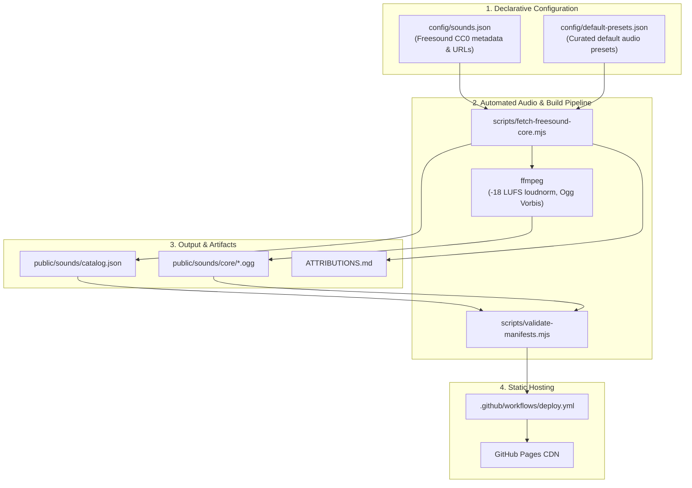

# Implementation Plan: Option A — Declarative CC0 Freesound Sound Catalog & Presets

## Executive Summary

This document details the architecture and operational workflow for **Option A**: a 100% static, maintainable, and editable sound catalog and ambient presets system built for deployment on **GitHub Pages**.

Option A eliminates runtime server dependencies, API rate limit concerns, and OAuth complexities by relying on a declarative configuration pipeline. All sound assets are sourced from public CC0-1.0 Freesound HQ previews, processed via `ffmpeg`, and published as static web assets alongside auto-generated attributions and catalog manifests.

---

## System Architecture



---

## 1. Declarative Configuration Schemas

To keep sound metadata and default ambient presets maintainable and human-editable, all data is decoupled from code into JSON files inside `config/`.

### 1.1 Sound Metadata Schema (`config/sounds.json`)

Contains metadata for each curated CC0 sound sourced from Freesound.

```json
[
  {
    "id": "rain_light",
    "title": "Light rain",
    "category": "rain",
    "tags": ["rain", "ambient", "field-recording", "freesound"],
    "freesoundId": 478665,
    "username": "DBlover",
    "originalTitle": "Rain ambient sounds",
    "license": "CC0-1.0",
    "previewPath": "previews/478/478665_7846219-hq.mp3",
    "pageUrl": "https://freesound.org/people/DBlover/sounds/478665/",
    "maxSec": 60,
    "crossfadeMs": 100
  },
  {
    "id": "fire_camp",
    "title": "Campfire",
    "category": "fire",
    "tags": ["fire", "campfire", "crackling", "loop", "freesound"],
    "freesoundId": 813328,
    "username": "NickTayloe",
    "originalTitle": "Crackling Flames (loop)",
    "license": "CC0-1.0",
    "previewPath": "previews/813/813328_11606594-hq.mp3",
    "pageUrl": "https://freesound.org/people/NickTayloe/sounds/813328/",
    "maxSec": 90,
    "crossfadeMs": 80,
    "loopMode": "native"
  }
]
```

### 1.2 Default Presets Schema (`config/default-presets.json`)

Defines curated default presets combining noise generators and ambient sample layers.

```json
[
  {
    "version": 1,
    "id": "cozy_fireplace",
    "name": "Cozy Fireplace",
    "master": {
      "volumeLinear": 0.85
    },
    "layers": [
      {
        "kind": "noise",
        "params": {
          "id": "noise-pink",
          "type": "pink",
          "volumeLinear": 0.35,
          "muted": false,
          "solo": false,
          "stereoWidth": 0.5,
          "pan": 0
        }
      },
      {
        "kind": "sample",
        "params": {
          "id": "sample-fire",
          "assetId": "fire_camp",
          "label": "Campfire",
          "volumeLinear": 0.75,
          "muted": false,
          "solo": false,
          "pan": 0,
          "loopMode": "native",
          "crossfadeMs": 80,
          "playbackRate": 1
        }
      }
    ]
  }
]
```

---

## 2. Audio Processing & Manifest Generation Pipeline

The audio build script (`scripts/fetch-freesound-core.mjs`) reads `config/sounds.json` and performs the following tasks:

### 2.1 Download & Staging
1. Downloads the HQ MP3 preview from Freesound's public CDN (`https://cdn.freesound.org/...`).
2. Caches the raw source audio in `assets-masters/freesound/<id>-src.mp3`.
3. Skips re-downloading if the local source file is already present.

### 2.2 Audio Processing via `ffmpeg`
1. **Trimming**: Trims audio to `maxSec` (typically 60–90 seconds) to balance file size and ambience continuity.
2. **Loudness Normalization**: Normalizes integrated loudness to `-18 LUFS` (`loudnorm=I=-18:TP=-1.5:LRA=11`) for seamless multi-layer audio mixing without clipping.
3. **Encoding**: Resamples to 48kHz stereo and encodes to high-efficiency **Ogg Vorbis** (`-c:a libvorbis -q:a 5`).
4. Saves final audio to `public/sounds/core/<id>.ogg`.

### 2.3 Catalog & Attribution Generation
1. **`public/sounds/catalog.json`**: Synthesizes the runtime sound manifest consumed by the Web Audio engine.
2. **`ATTRIBUTIONS.md`**: Generates a human-readable attribution document listing original titles, authors, sound IDs, Freesound links, and SPDX CC0-1.0 licensing notes.

### 2.4 Manifest Validation
Runs `scripts/validate-manifests.mjs` to ensure:
- Every asset defined in `catalog.json` exists as a physical `.ogg` file on disk.
- No orphan sound files exist in `public/sounds/core/`.
- Preset asset references in default presets map to valid sound IDs.

---

## 3. Visual Preset Editing & Maintenance Workflow

To maintain and update presets easily without manual JSON editing:

1. **Local Tuning**:
   - Run `pnpm dev` to launch the application locally at `http://localhost:5173/`.
   - Add noise layers and ambient samples, adjust volumes, pan, and playback rates in the UI Mixer.
2. **Preset Export**:
   - Click **"Save Preset"** in the UI to snapshot the current mix.
   - Click **"Export Preset JSON"** to copy the exact `PresetV1` structure to your clipboard.
3. **Version Control**:
   - Paste the exported JSON into `config/default-presets.json`.
   - Commit changes to Git.

---

## 4. Continuous Integration & Deployment (GitHub Actions)

A GitHub Actions workflow (`.github/workflows/deploy.yml`) automates build verification and deployment to GitHub Pages on every push to `main`.

### Workflow Steps:
1. **Checkout & Environment Setup**: Installs Node.js 20, `pnpm`, and `ffmpeg`.
2. **Audio Processing & Sync**: Runs `pnpm sounds:freesound` to verify or fetch missing audio previews.
3. **Validation**: Executes `pnpm validate-manifests` and `pnpm check`.
4. **Vite Build**: Builds production SPA into `dist/`.
5. **Publish**: Deploys `dist/` directly to `gh-pages` branch.

---

## 5. Summary of Developer Commands

| Task | Command |
| :--- | :--- |
| **Start Local Dev Server** | `pnpm dev` |
| **Fetch & Build Freesound Audio** | `pnpm sounds:freesound` |
| **Validate Manifests & Assets** | `pnpm validate-manifests` |
| **Run Type & Svelte Checks** | `pnpm check` |
| **Build Production App** | `pnpm build` |
